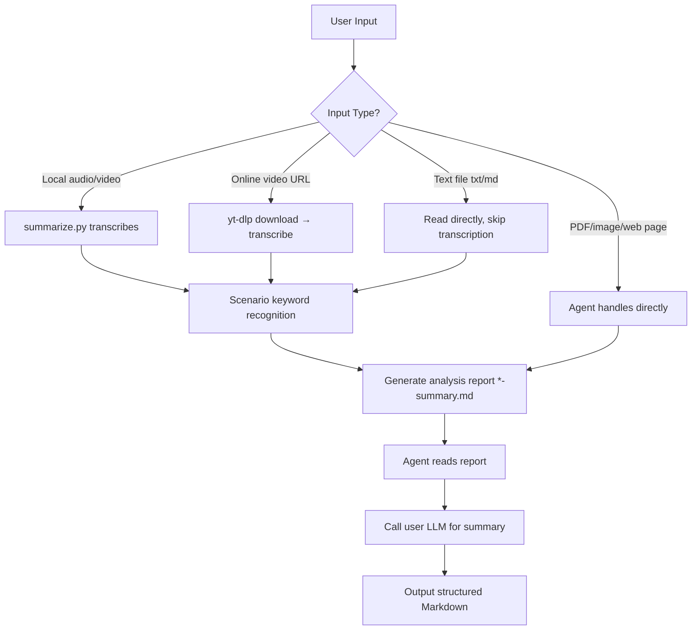

## Overview

This Skill converts **various input content** into a structured analysis report for the Agent to summarize, in two phases:

1. **Skill handles**: Content acquisition (download/read) → Transcription → Scenario recognition → Output analysis report
2. **Agent handles**: Read analysis report → Call user-configured LLM → Generate final summary

---

## Supported Input Types

| Input Type | Example | Processing Method |
| ---------- | ------- | ----------------- |
| **Local audio** | `meeting.mp3`, `record.m4a` | Upload directly to transcription API |
| **Local video** | `video.mp4`, `lesson.mov` | Extract audio then transcribe (requires ffmpeg) |
| **Online video URL** | YouTube, TikTok, Instagram, X, etc. | yt-dlp extracts audio then transcribes |
| **PDF file** | `report.pdf` | Agent reads text directly, no script needed |
| **Image** | `screenshot.png` | Agent uses vision, no script needed |
| **Web page URL** | `https://example.com/article` | Agent fetches body content, no script needed |
| **Text document** | `notes.txt`, `doc.md` | Read file content directly, skip transcription |

> PDF, images, and web pages are handled directly by the Agent — no need to call `summarize.py`.

---

## Core Scripts

### `scripts/summarize.py` — Main Entry Point

**Typical usage** (Agent call):

```bash
python3 skills/summarize-pro/scripts/summarize.py <input_file_or_URL> --full --quiet
```

**Parameters**:

| Parameter | Description |
| --------- | ----------- |
| `--full` / `-f` | Full mode: transcription + scenario recognition + analysis report (recommended) |
| `--quiet` / `-q` | Quiet mode: only key progress output, suitable for Agent calls |
| `--transcribe-only` / `-t` | Transcription only, no scenario analysis |
| `--summarize-only` | Scenario analysis only (input must be existing text file) |
| `--type <type>` | Force scenario type (meeting/interview/lecture/podcast/general) |
| `--language` / `-l` | Language code (default: auto-detect) |
| `--output` / `-o` | Specify output directory; defaults to auto-generated timestamp directory |

**Output files** (default path):

```text
./summarizer-files/<timestamp>/<filename>-transcript.txt
./summarizer-files/<timestamp>/<filename>-summary.md
```

The last line of stdout outputs the **absolute path** to `summary.md` for the Agent to read.

### `scripts/transcribe.py` — Transcription Sub-script

Called internally by `summarize.py` — Agent does not need to call this directly.

```bash
python3 scripts/transcribe.py <audio_file> [--language en]
```

Transcription result is output to stdout; `summarize.py` captures it and writes to `*-transcript.txt`.

---

## Dependencies

| Phase | Dependency | Description |
| ----- | ---------- | ----------- |
| **Transcription** | Platform transcription API | Built-in, no user API key needed |
| **Scenario Recognition** | None | Pure keyword matching, no API needed |
| **Summarization** | User-configured LLM | Agent handles this, not in this script |
| **Video format conversion** | ffmpeg (optional) | For mov/avi/mkv and files >25MB |
| **Online video download** | yt-dlp (optional) | YouTube, TikTok, Instagram, X, etc. |

---

## Scenario Recognition Rules

Logic: Count keyword matches in the first 3000 characters; 3+ hits → classify as that scenario.

| Scenario | Code | Keywords | Threshold |
| -------- | ---- | -------- | --------- |
| **Meeting** | `meeting` | discussion, decision, action item, agenda, meeting, team, deadline, owner, next step... | ≥3 |
| **Interview** | `interview` | interview, pain point, feedback, user, experience, candidate, background... | ≥3 |
| **Lecture** | `lecture` | course, lecture, learning, concept, outline, student, lesson, chapter... | ≥3 |
| **Podcast** | `podcast` | podcast, guest, episode, host, topic, story, opinion, show... | ≥3 |
| **General** | `general` | Fallback when no scenario matches | — |

> Use `--type` to force a specific scenario type if auto-detection isn't accurate.

---

## Workflow



---

## Analysis Report Format

`*-summary.md` structure:

```text
# 📊 Transcription Analysis Report

Filename, processing time, content type, character count, estimated duration

## 🎯 Scenario Recognition Result
Scenario type + summary strategy guidance

## 📝 Full Transcript
Complete transcription text

## 🤖 Next Step
Agent operation prompt
```

The Agent reads this report, then follows the "Summary Strategy" to call the LLM and generate the final user summary.

---

## Error Handling

| Error | Behavior |
| ----- | -------- |
| OpenClaw not logged in | `sys.exit(1)`, prints login instructions |
| yt-dlp not installed | Prints install instructions, `return False` |
| Transcription API failure | `sys.exit(1)`, prints API error |
| File not found | `sys.exit(1)`, prints path |
| ffmpeg not available | Graceful degradation (upload original file directly), no interruption |
